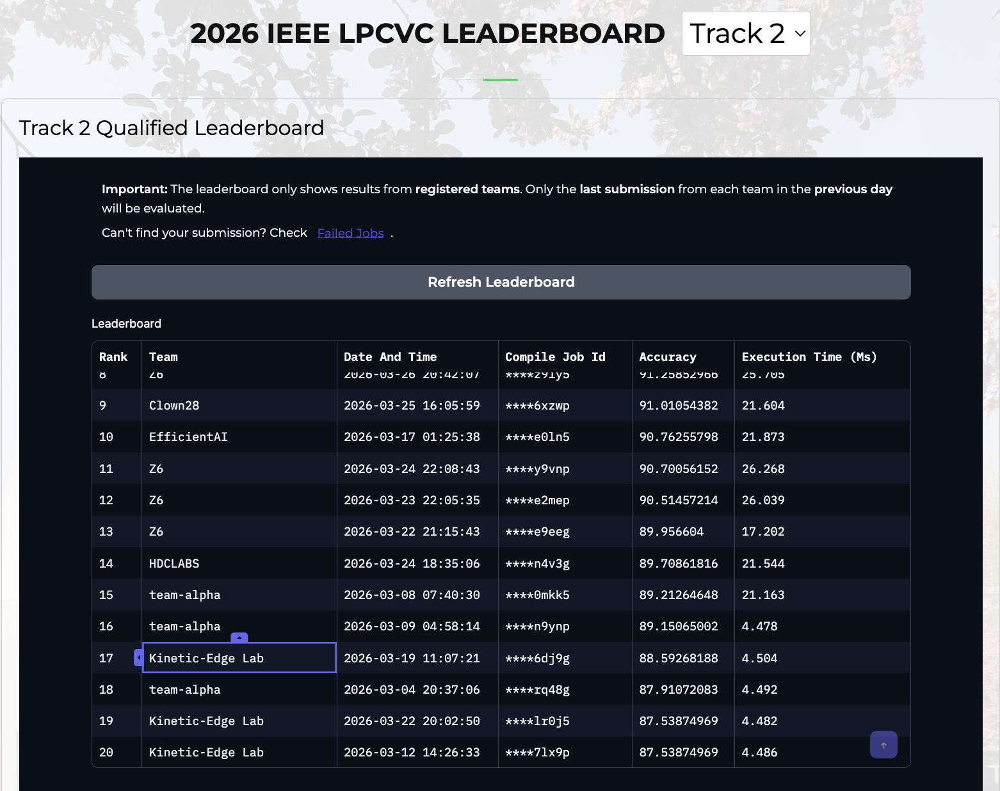

# edge-active - Video Action Recognition on Edge Devices

Submission for the [Low-Power Computer Vision Challenge (LPCVC) 2026, Track 2](https://lpcv.ai/2026LPCVC/tracks/track2/). The task is classifying exercise videos into 92 classes on a Qualcomm Dragonwing IQ-9075 EVK, under tight inference-time constraints.

## Best Submission

| Metric | Value |
| --- | --- |
| **Test Accuracy** | **88.59%** |
| **Inference Time** | **4.486ms** |
| **Leaderboard Rank** | **#4** (Kinetic-Edge Lab) |
| Model | R(2+1)D-18 |
| Quantization | INT8 |
| Resolution | 112×112 |
| Clips per video (inference) | 1 |

## 🎯 Challenge Overview

**Task:** Video Action Recognition (Exercise Classification)  
**Dataset:** QEVD (Qualcomm Exercise Video Dataset)  
**Device:** Qualcomm Dragonwing IQ-9075 EVK
**Execution time:** <34ms (Stage 1 cutoff), <21.5ms to be competitive
**Quantization:** INT8
**Deadline:** March 1 - April 30, 2026

## Dataset

### QEVD-Fit-300k

| Split | Videos |
| --- | --- |
| Train | 190,254 |
| Val | 11,452 |
| Classes | 92 exercise classes |

Required input: 16 frames per clip at 4fps.

**Key Constraints:**

- Input: 16-frame video clips (3, 16, 112, 112)
- Inference time: Must be <34ms
- Evaluation: Accuracy / max(Execution Time / Time Limit, 1)

## Project Structure

```bash
edge-active/
├── src/
│   ├── train.py          # Main training loop, evaluation, early stopping
│   ├── dataset.py        # QEVD dataset, multi-clip sampling, Decord VideoReader
│   ├── presets.py        # Augmentation presets (colour jitter, random erasing, horizontal flip)
│   └── early_stopper.py  # EarlyStopper utility (monitors val accuracy)
├── configs/
│   ├── class_map.json          # 92-class label mapping
│   └── class_flip_mapping.json # Horizontal flip label remapping (e.g. hook_left ↔ uppercut_right)
└── scripts/
    └── inspect_checkpoints.py  # Checkpoint inspection utility
    └── data_metadata_cache.py  # Generate metadata about dataset utility

```

---

## Setup

```bash
conda create -n lpcvc python=3.10
conda activate lpcvc
pip install torch torchvision decord
```

---

## Training

```bash
python src/train.py \
    --data-path /path/to/QEVD_organised \
    --device cuda \
    --train-batch-size 32 \
    --val-batch-size 8 \
    --workers 14 \
    --amp \
    --epochs 10 \
    --train-clips-per-video 1 \
    --val-clips-per-video 3 \
    --lr 5e-5 \
    --weight-decay 0.05 \
    --dropout 0.1 \
    --label-smoothing 0.1 \
    --lr-warmup-epochs 1 \
    --early-stopping-patience 3 \
    --load-best-checkpoint \
    --output-dir /path/to/output \
    | tee training.log
```

**Important:** always pass `--load-best-checkpoint` when fine-tuning from a saved checkpoint. Verify in the log that the run prints `Loaded from epoch X` before trusting any training output.

---

## Key Lessons Learned

- **Train clips = 1** with random temporal sampling provides enough variety without causing memorization
- **Val clips = 3** gives stable estimates without inflating metrics (5 clips inflates val by ~5–6% vs. test)
- **AdamW needs strong regularization**: `weight_decay=0.05`, not 0.0001
- **Train accuracy >97%** is a reliable sign of overfitting — target 94–96%
- **Val→Test gap >6%** means the val setup is misconfigured or the model is overfit
- **Decord** is dramatically faster than `torchvision.datasets.VideoClips` for this dataset

---

## Experiment Journal

Full experiment notes, configs, failure analysis, and lessons learned:

👉 [JOURNAL_EXPERIMENTS.md](docs/JOURNAL_EXPERIMENTS.md)

---

## Leaderboard (as of March 30, 2026)

| Rank | Team | Accuracy | Inference Time |
| --- | --- | --- | --- |
| 1 | EfficientAI | 92.00% | 21.756ms |
| 2 | EfficientAI | 91.88% | 4.489ms |
| **17** | **Kinetic-Edge Lab (ours)** | **88.59%** | **4.486ms** |
| 19 | Kinetic-Edge Lab | 87.54% | 4.482ms |


---

## Competition Deadline

**April 30, 2025** — [lpcv.ai/2026LPCVC/tracks/track2](https://lpcv.ai/2026LPCVC/tracks/track2/)
